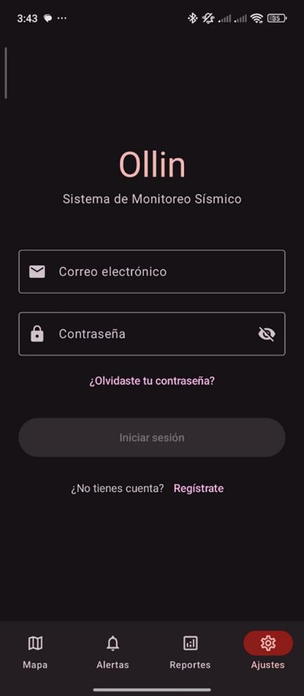
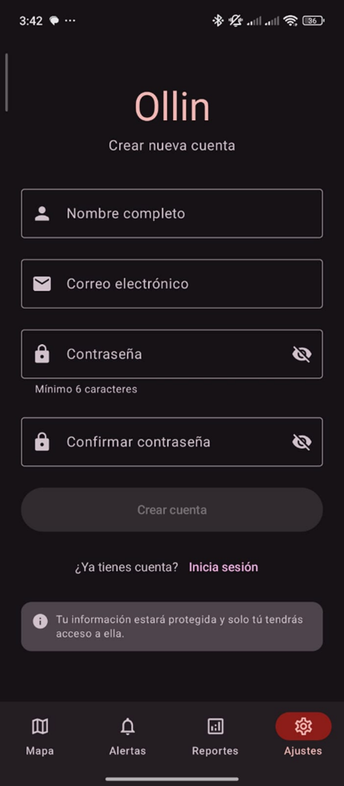
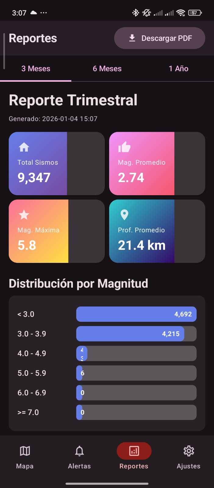
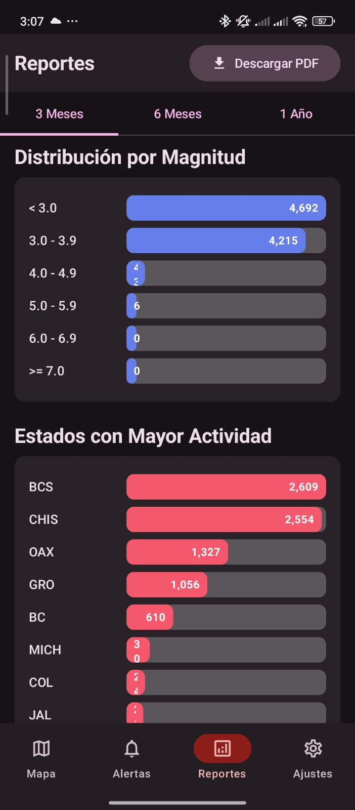
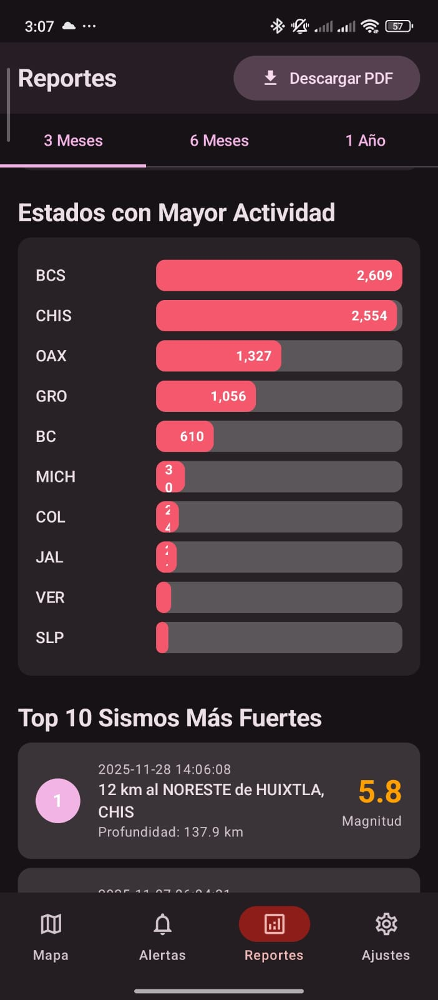
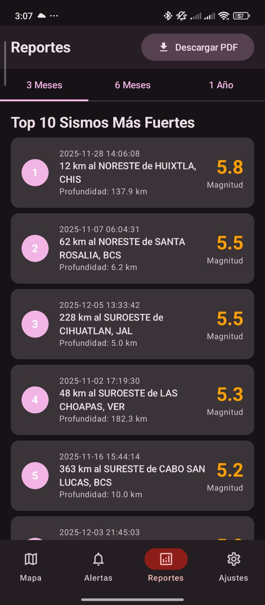
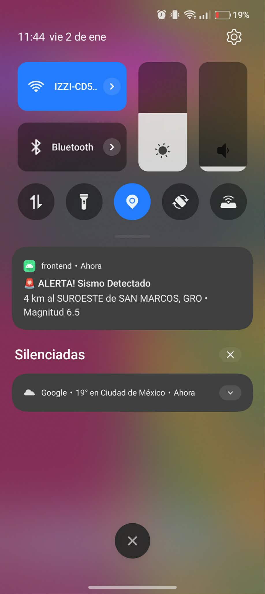

<p align="center">
    <h1 align="center">🌎 Ollin - Seismic Monitoring System</h1>
</p>
<p align="center">
    <em>Real-time seismic monitoring application for Mexico</em>
</p>
<p align="center">
	
	
	
	
</p>

<p align="center">
	<em>Developed with the software and tools below.</em>
</p>
<p align="center">
	
	
	
	
	
	
	
	
	
	
</p>
<hr>

## 🚀 Getting Started

### Prerequisites

**Backend:**
- Java 21+
- Docker & Docker Compose
- PostgreSQL 15+

**Frontend:**
- Android Studio
- JDK 17+
- Android SDK 34+

### Backend Setup

1. Clone the repository:
```bash
git clone https://github.com/JohannTF/Ollin.git
cd Ollin/backend
```

2. Create `.env` file:
```env
DB_URL=jdbc:postgresql://localhost:5432/sismosdb
DB_USERNAME=postgres
DB_PASSWORD=your_password
REDIS_HOST=localhost
REDIS_PORT=6379
REDIS_PASSWORD=
FIREBASE_SERVICE_ACCOUNT_PATH=[fileName].json
```

> **Important**: Place the Firebase service account JSON file in the `backend/` directory. This file is ignored by git for security.

3. Start services:
```bash
docker-compose up -d

# Verificar que los contenedores estén corriendo
docker ps
```

4. Create database:
```bash
psql -U postgres
CREATE DATABASE sismosdb;
\q
```

5. Run the backend:
```bash
./gradlew bootRun
```

API will be available at `http://localhost:8080`

### Frontend Setup

1. Open `frontend/` in Android Studio

2. Configure `local.properties`:
```properties
sdk.dir=C\:\\Users\\YourUser\\AppData\\Local\\Android\\Sdk
MAPS_API_KEY=YOUR_GOOGLE_MAPS_API_KEY
BACKEND_URL=http://10.0.2.2:8080/
```

> **Note**: Use `http://10.0.2.2:8080/` for emulator or `http://YOUR_LOCAL_IP:8080/` for physical device

3. Place Firebase Google Services file:
   - Download `google-services.json` from Firebase Console
   - Place it in `frontend/app/`
   - This file is automatically ignored by git for security

4. Get Google Maps API Key from [Google Cloud Console](https://console.cloud.google.com/)

5. Sync dependencies: **File → Sync Project with Gradle Files**

6. Run the app:
```bash
./gradlew installDebug
```

## Screenshots

### Authentication
<p align="center">
  
  
</p>

### Main Features
<p align="center">
  
  
  
  
  
</p>

### Notifications
<p align="center">
  
</p>

### 📖 Documentation

- API Docs (When server is running): http://localhost:8080/swagger-ui/index.html
- Data source: [Servicio Sismológico Nacional](http://www.ssn.unam.mx)

## 📝 License

This project is licensed under the MIT License.

## 🤟 Contributors

<table>
  <tr>
    <td align="center">
      <a href="https://github.com/JohannTF">
        <br />
        <sub><b>Johann Trejo Flores</b></sub>
      </a><br />
    </td>
    <td align="center">
      <a href="https://github.com/LuisGerH">
        <br />
        <sub><b>Luis Gerardo</b></sub>
      </a><br />
    </td>
  </tr>
</table>